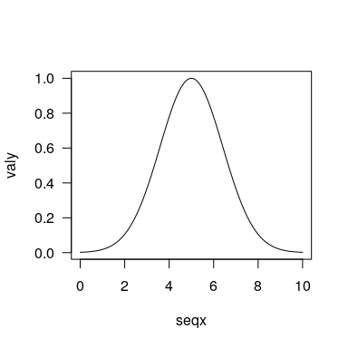

# biogeonet

[](https://github.com/KevCaz/biogeonet/actions)
[](https://codecov.io/gh/KevCaz/biogeonet)

R (and Rcpp) implementation for Cazelles *et al.* 2016
<DOI:10.1111/ecog.01714>

    #>   ─  installing *source* package ‘biogeonet’ ...
    #>      ** using staged installation
    #>      ** libs
    #>      g++ -std=gnu++11 -I"/usr/share/R/include" -DNDEBUG  -I"/usr/local/lib/R/site-library/Rcpp/include" -I"/usr/local/lib/R/site-library/RcppArmadillo/include"  -fopenmp  -fpic  -g -O2 -fdebug-prefix-map=/home/jranke/git/r-backports/buster/r-base-3.6.3=. -fstack-protector-strong -Wformat -Werror=format-security -Wdate-time -D_FORTIFY_SOURCE=2 -g  -UNDEBUG -Wall -pedantic -g -O0 -c RcppExports.cpp -o RcppExports.o
    #>      g++ -std=gnu++11 -I"/usr/share/R/include" -DNDEBUG  -I"/usr/local/lib/R/site-library/Rcpp/include" -I"/usr/local/lib/R/site-library/RcppArmadillo/include"  -fopenmp  -fpic  -g -O2 -fdebug-prefix-map=/home/jranke/git/r-backports/buster/r-base-3.6.3=. -fstack-protector-strong -Wformat -Werror=format-security -Wdate-time -D_FORTIFY_SOURCE=2 -g  -UNDEBUG -Wall -pedantic -g -O0 -c buildMarkov.cpp -o buildMarkov.o
    #>      g++ -std=gnu++11 -I"/usr/share/R/include" -DNDEBUG  -I"/usr/local/lib/R/site-library/Rcpp/include" -I"/usr/local/lib/R/site-library/RcppArmadillo/include"  -fopenmp  -fpic  -g -O2 -fdebug-prefix-map=/home/jranke/git/r-backports/buster/r-base-3.6.3=. -fstack-protector-strong -Wformat -Werror=format-security -Wdate-time -D_FORTIFY_SOURCE=2 -g  -UNDEBUG -Wall -pedantic -g -O0 -c colonization.cpp -o colonization.o
    #>      g++ -std=gnu++11 -I"/usr/share/R/include" -DNDEBUG  -I"/usr/local/lib/R/site-library/Rcpp/include" -I"/usr/local/lib/R/site-library/RcppArmadillo/include"  -fopenmp  -fpic  -g -O2 -fdebug-prefix-map=/home/jranke/git/r-backports/buster/r-base-3.6.3=. -fstack-protector-strong -Wformat -Werror=format-security -Wdate-time -D_FORTIFY_SOURCE=2 -g  -UNDEBUG -Wall -pedantic -g -O0 -c extinction.cpp -o extinction.o
    #>      g++ -std=gnu++11 -I"/usr/share/R/include" -DNDEBUG  -I"/usr/local/lib/R/site-library/Rcpp/include" -I"/usr/local/lib/R/site-library/RcppArmadillo/include"  -fopenmp  -fpic  -g -O2 -fdebug-prefix-map=/home/jranke/git/r-backports/buster/r-base-3.6.3=. -fstack-protector-strong -Wformat -Werror=format-security -Wdate-time -D_FORTIFY_SOURCE=2 -g  -UNDEBUG -Wall -pedantic -g -O0 -c getEigenElements.cpp -o getEigenElements.o
    #>      g++ -std=gnu++11 -I"/usr/share/R/include" -DNDEBUG  -I"/usr/local/lib/R/site-library/Rcpp/include" -I"/usr/local/lib/R/site-library/RcppArmadillo/include"  -fopenmp  -fpic  -g -O2 -fdebug-prefix-map=/home/jranke/git/r-backports/buster/r-base-3.6.3=. -fstack-protector-strong -Wformat -Werror=format-security -Wdate-time -D_FORTIFY_SOURCE=2 -g  -UNDEBUG -Wall -pedantic -g -O0 -c getEigenElementsSp.cpp -o getEigenElementsSp.o
    #>      g++ -std=gnu++11 -I"/usr/share/R/include" -DNDEBUG  -I"/usr/local/lib/R/site-library/Rcpp/include" -I"/usr/local/lib/R/site-library/RcppArmadillo/include"  -fopenmp  -fpic  -g -O2 -fdebug-prefix-map=/home/jranke/git/r-backports/buster/r-base-3.6.3=. -fstack-protector-strong -Wformat -Werror=format-security -Wdate-time -D_FORTIFY_SOURCE=2 -g  -UNDEBUG -Wall -pedantic -g -O0 -c nichemodel.cpp -o nichemodel.o
    #>      nichemodel.cpp: In function ‘Rcpp::NumericMatrix nicheModel(int, double, int)’:
    #>    nichemodel.cpp:53:15: warning: suggest parentheses around comparison in operand of ‘&’ [-Wparentheses]
    #>           if (mode==2 & i!=j) {
    #>               ~~~~^~~
    #>      g++ -std=gnu++11 -shared -L/usr/lib/R/lib -Wl,-z,relro -o biogeonet.so RcppExports.o buildMarkov.o colonization.o extinction.o getEigenElements.o getEigenElementsSp.o nichemodel.o -fopenmp -llapack -lblas -lgfortran -lm -lquadmath -L/usr/lib/R/lib -lR
    #>      installing to /tmp/devtools_install_185477cb7e15/00LOCK-biogeonet/00new/biogeonet/libs
    #>      ** checking absolute paths in shared objects and dynamic libraries
    #>   ─  DONE (biogeonet)
    #> 

## Installation

To get the current development version of this repository from R, use
the [`remotes`](https://CRAN.R-project.org/package=remotes) package like
so:

``` r
if (!require("remotes'")) install.packages("remotes")
remotes::install_github("KevCaz/biogeonet")
library(biogeonet)
```

## About the paper

### Reference:

  - Cazelles, K., Mouquet, N., Mouillot, D. & Gravel, D. On the
    integration of biotic interaction and environmental constraints at
    the biogeographical scale. Ecography (Cop.). 39, 921–931 (2016).
    [DOI:10.1111/ecog.01714](http://onlinelibrary.wiley.com/doi/10.1111/ecog.01714/abstract)

### Abstract:

> Biogeography is primarily concerned with the spatial distribution of
> biodiversity, including performing scenarios in a changing
> environment. The efforts deployed to develop species distribution
> models have resulted in predictive tools, but have mostly remained
> correlative and have largely ignored biotic interactions. Here we
> build upon the theory of island biogeography as a first approximation
> to the assembly dynamics of local communities embedded within a
> metacommunity context. We include all types of interactions and
> introduce environmental constraints on colonization and extinction
> dynamics. We develop a probabilistic framework based on Markov chains
> and derive probabilities for the realization of species assemblages,
> rather than single species occurrences. We consider the expected
> distribution of species richness under different types of ecological
> interactions. We also illustrate the potential of our framework by
> studying the interplay between different ecological requirements,
> interactions and the distribution of biodiversity along an
> environmental gradient. Our framework supports the idea that the
> future research in biogeography requires a coherent integration of
> several ecological concepts into a single theory in order to perform
> conceptual and methodological innovations, such as the switch from
> single-species distribution to community distribution

## Examples

To be included in the vignette.

### Niche model

``` r
nicheModel(5, .2, 1)
#>      [,1] [,2]       [,3]       [,4]       [,5]
#> [1,]    0    0  0.0000000  0.0000000  0.0000000
#> [2,]    0    0  0.0000000  0.0000000  0.0000000
#> [3,]    0    0  0.0000000  0.3655858  0.4816922
#> [4,]    0    0 -0.2138786 -0.9735498 -0.5375986
#> [5,]    0    0 -0.5162009  0.5944290  0.0000000
```

### Colonization

``` r
par(las=1)
seqx <- seq(0,10,.01)
valy <- sapply(seqx, FUN=colonization, 1, 5, 2)
plot(seqx, valy, type="l")
```

<!-- -->

## TODO

  - [ ] Convert all the C code I originally used to
    [Rcpp](https://github.com/RcppCore/Rcpp)
  - [ ] write a minimal documentation including the simulations (or the
    exact way of how to proceed with a number of species lower that what
    it was in the paper) presented within the paper;
  - [x] use \~RcppEigen or\~ Armadillo to solve the Markov chain.
