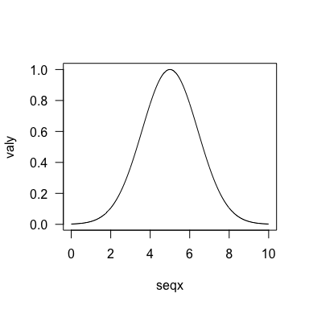

biogeonet
=========

R (Rcpp) implementation for Cazelles *et al.* 2016 <DOI:10.1111/ecog.01714>

    ## Loading biogeonet

Installation
------------

To get the current development version of this repository from R, use the [*devtools*](http://cran.r-project.org/web/packages/devtools/index.html) package like so:

``` r
if (!require("devtools'")) install.packages("devtools")
devtools::install_github("KevCaz/biogeonet")
library(biogeonet)
```

Current Status
--------------

[](https://travis-ci.org/KevCaz/biogeonet) [](https://ci.appveyor.com/project/KevCaz/biogeonet/build/1.0.7) [](https://codecov.io/gh/KevCaz/biogeonet)

About the paper
---------------

-   **Reference**:

Cazelles, K., Mouquet, N., Mouillot, D. & Gravel, D. On the integration of biotic interaction and environmental constraints at the biogeographical scale. Ecography (Cop.). 39, 921–931 (2015). [DOI:10.1111/ecog.01714](http://onlinelibrary.wiley.com/doi/10.1111/ecog.01714/abstract).

-   **Abstract**:

> Biogeography is primarily concerned with the spatial distribution of biodiversity, including performing scenarios in a changing environment. The efforts deployed to develop species distribution models have resulted in predictive tools, but have mostly remained correlative and have largely ignored biotic interactions. Here we build upon the theory of island biogeography as a first approximation to the assembly dynamics of local communities embedded within a metacommunity context. We include all types of interactions and introduce environmental constraints on colonization and extinction dynamics. We develop a probabilistic framework based on Markov chains and derive probabilities for the realization of species assemblages, rather than single species occurrences. We consider the expected distribution of species richness under different types of ecological interactions. We also illustrate the potential of our framework by studying the interplay between different ecological requirements, interactions and the distribution of biodiversity along an environmental gradient. Our framework supports the idea that the future research in biogeography requires a coherent integration of several ecological concepts into a single theory in order to perform conceptual and methodological innovations, such as the switch from single-species distribution to community distribution

Examples
--------

### Niche model

``` r
nicheModel(5, .2, 1)
#>            [,1]       [,2]       [,3]        [,4]      [,5]
#> [1,]  0.0000000  0.3387094  0.7544250  0.04259914 0.0000000
#> [2,] -0.2821141  0.0000000  0.4171265  0.05668624 0.5891225
#> [3,] -0.9987329 -0.6364062 -0.7293051  0.84278257 0.0000000
#> [4,] -0.7711953 -0.2537464 -0.3307729 -0.21460014 0.0000000
#> [5,]  0.0000000 -0.3971602  0.0000000  0.00000000 0.0000000
```

### Colonzation

``` r
par(las=1)
seqx <- seq(0,10,.01)
valy <- sapply(seqx, FUN=colonization, 1, 5, 2)
plot(seqx, valy, type="l")
```



TODO
----

-   \[ \] Convert all the C/C++ code to RCPP (should not be that difficult);
-   \[ \] write a mimi doc including the simulation presented within the paper;
-   \[ \] use RcppEigen or Armadillo to solve the Markov chain.
